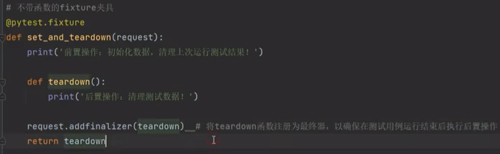
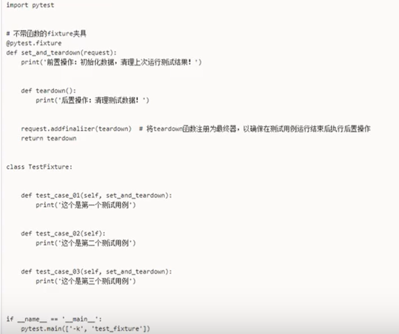
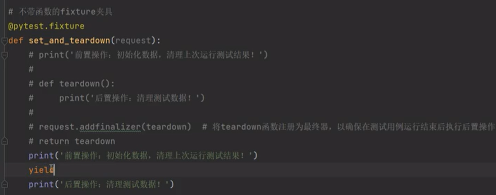
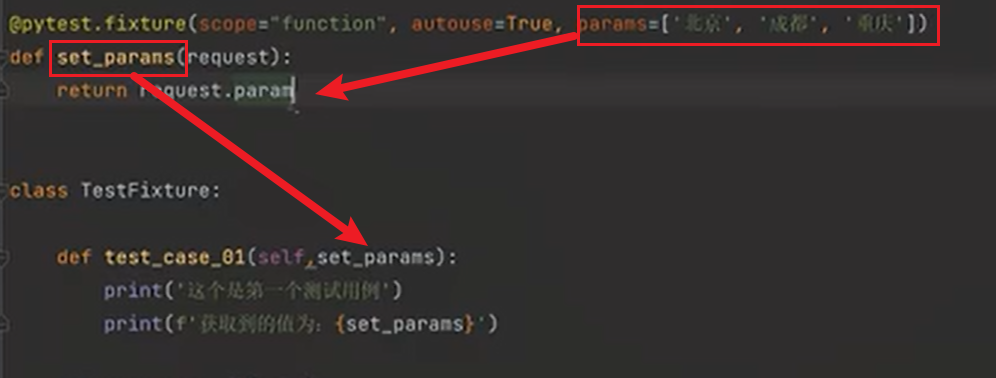
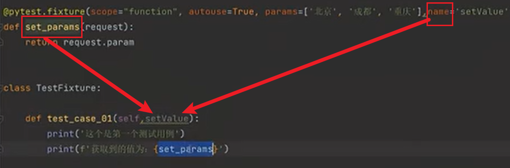
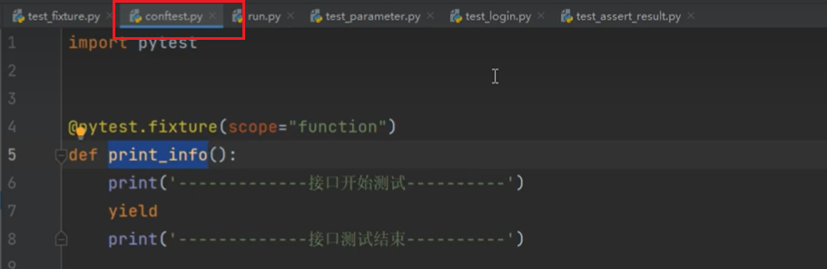

## 测试用例执行顺序
#### 方法一：order
   @pytest.mark.run(order=顺序)
#### 方法二：
1. pytest.ini的注册自定义标记：
   markers = last second first
2. 测试用例（用的自定义标签）
   @pytest.mark.last
   @pytest.mark.second
   @pytest.mark.first

## 重跑机制
#### 基本配置
1. pip install pytest-rerunfailures
2. pytest.ini的addopts参数配置:
   * addopts = -s -v- -n 并发次数 --reruns 重跑次数
#### 方法一：指定测试用例重跑设置
   @pytest.mark.flaky(rerun=次数，reruns_delay=失败重跑间隔时间)
#### 方法一：全局测试用例重跑设置

## 并发测试
1. pip install pytest-xdist
2. pytest.ini的addopts参数配置：
   * addopts = -s -v- -n 并发次数 --reruns 重跑次数

## 断言
1. assert 判断语句，断言失败要执行的语句【相等断言】
   * assert 1==2,'断言失败，不想等！'
   * assert 1!=1,'断言失败，想等！'
2. assert A in B【包含断言】
   * assert 'pytest' in 'pytest is ok'
3. assert 集合A == 集合B【集合断言】
   * assert {1,2,3,4}=={4,3,2,1}

## 分组
自定义标签之后：pytest -vs -m "标签名":
1. pytest.ini的注册自定义标记：
   markers = last second first P1 P3
2. 测试用例
   @pytest.mark.P1
   @pytest.mark.second
   @pytest.mark.P3
3. 执行
   * 配置文件实现: addopts = -s -v -m "P1 or P3"
   * 命令行实现: pytest -sv -m "P1 or P3"
4. 跳过执行
   * @pytest.mark.skip装饰器
   * @pytest.mark.skipif(condition=满足条件，reason=原因说明)装饰器皿
   * @pytest.mark.xfail装饰器皿：断言失败不执行该用例

## 参数化
1. @pytest.mark.parameterize(数据元祖列表[(),(),()])
1. @pytest.mark.parameterize(数据列表[,,])
1. @pytest.mark.parameterize(数据键值对{'key1':value1,'key2':value2,....}})
1. @pytest.mark.parameterize(数据元祖(,,,,))
1. @pytest.mark.parameterize('指定参数名称1,指定参数名称2...'数据[(),(),()])

## 前后置处理
1. setup、teardown..
   * setup：每个测试函数执行前，多少个函数执行多少次 
   * teardown：每个测试函数执行后，多少个函数执行多少次 
   * teardown: 在测试类执行前进行这个操作，只执行一次 
   * teardown_class: 在测试类执行后进行这个操作，只执行一次
2. Fixture:可以用于在测试函数执行前后进行一些初始化、清理、共享状态、资源的操作。
   * 
   * 
   * 
   * 带参数：
     * scope：作用范围： function（默认，测试函数前后运行一次）、class（类级别，只在测试类前后运行一次）、session（多个.py文件前后执行一次：多个py文件算一个py，然后这个py前后只执行一次）、module（每个.py文件执行前后运行一次）
     * autouse：默认是false，是否不需要在测试函数里手动调用。
     * params：用于参数化
     * 
     * name：为fixture函数重新定义一个别名，测试函数调用的时候用name
     * 
     * ids：给参数化起别名。
3. 全局的前后置应用操作：@pytest.fixture和conftest.py
   * 每个conftest.py文件都会对其所在的目录及其子目录下的测试模块生效
   * 在不同模块的测试中需要用到conftest.py的前后置功能时，不需要在任何的导入操作，可以直接在测试函数的参数中使用fixture名称
   * 可以在不同的py使用同一个fixture函数
   * 

## 钩子函数

       

